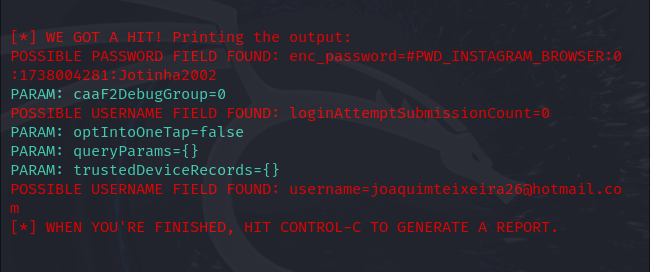

# Phishing para Captura de Senhas do Instagram

## Ferramentas
| **Ferramenta** | **Descrição** |
|----------------|---------------|
| **Kali Linux** | Sistema operacional para testes de segurança. |
| **setoolkit**  | Ferramenta usada para criar e configurar ataques de phishing. |

## Configurando o Phishing no Kali Linux
| **Passo**                          | **Comando/Opção**                                        |
|-------------------------------------|----------------------------------------------------------|
| **Acesso root**                     | `sudo su`                                                |
| **Iniciando o setoolkit**           | `setoolkit`                                              |
| **Tipo de ataque**                  | `Social-Engineering Attacks`                             |
| **Vetor de ataque**                 | `Web Site Attack Vectors`                                |
| **Método de ataque**                | `Credential Harvester Attack Method`                     |
| **Método de ataque (Clonagem)**     | `Site Cloner`                                            |
| **Obtendo o endereço da máquina**   | `ifconfig`                                               |
| **URL para clonar**                 | `http://www.instagram.com`                                |

### Resultados

